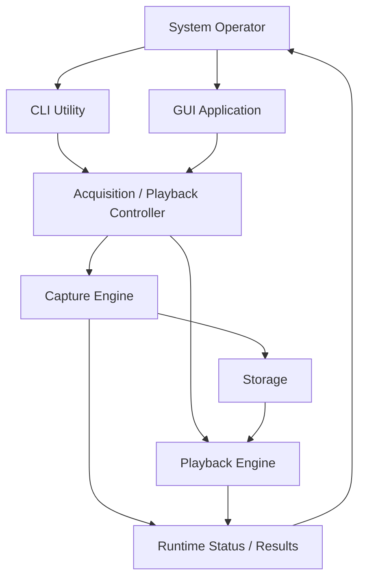
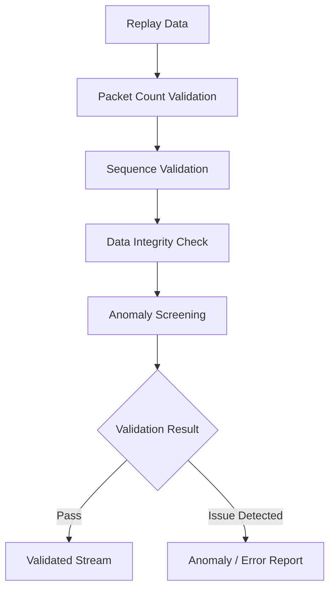
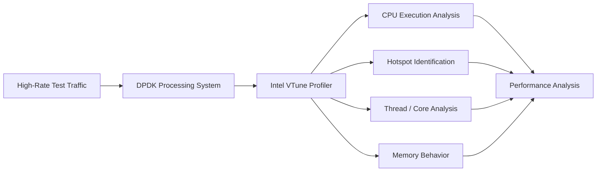
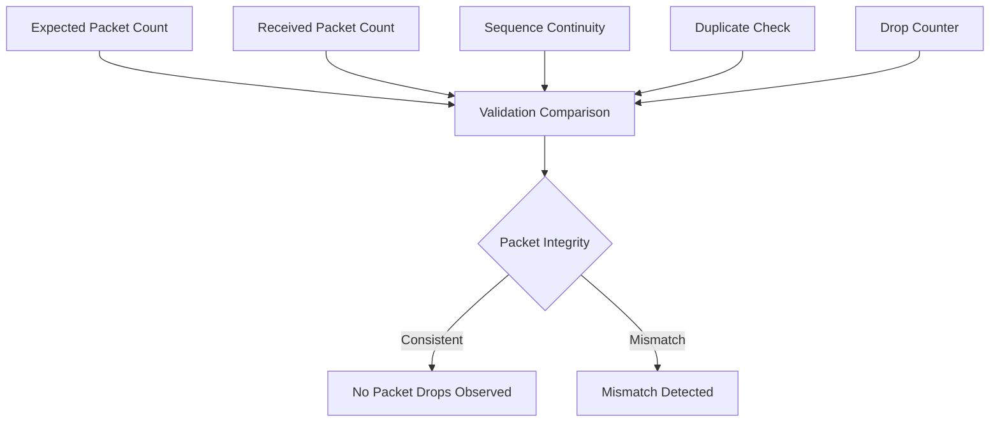
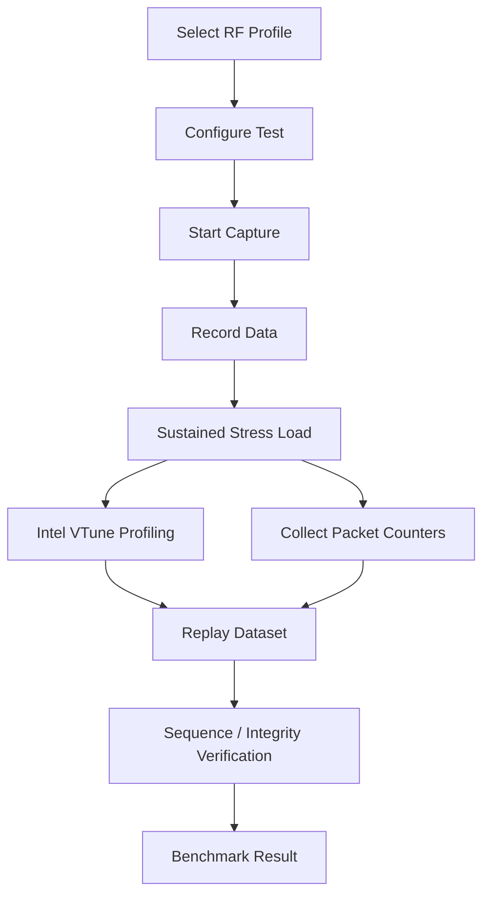
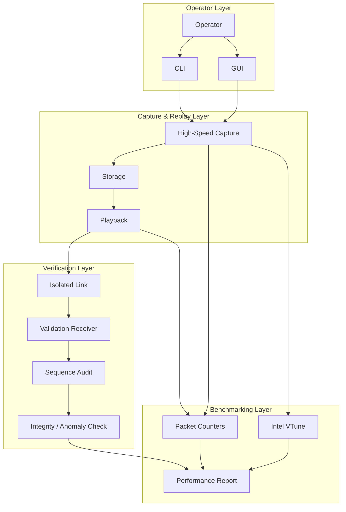

<div style="margin: 15px 0 25px 0;">
  <a href="https://your-detailed-docs-site.com/part5-benchmarks" target="_blank" rel="noopener noreferrer" class="btn btn--primary" style="padding: 10px 18px; text-decoration: none; border-radius: 6px;">
    <i class="fas fa-external-link-alt"></i> View Detailed Interface & Benchmark Docs
  </a>
</div>

# Part 5: Validation, Benchmarking & Operator Interfaces

## Overview

The final stage of the platform focuses on **system validation, performance
profiling, operator interaction, and record/playback verification**.

After the RF acquisition, DPDK processing, telemetry, and observability layers
are operational, the complete system must prove that high-speed satellite data
can be:

- Captured reliably
- Written to storage
- Replayed deterministically
- Transported across the validation link
- Checked for sequence integrity
- Screened for anomalies
- Operated through practical CLI and GUI tools
- Sustained under high packet volumes without observed packet loss

Performance behavior is additionally analyzed using **Intel VTune**, allowing
the runtime characteristics of the high-speed processing pipeline to be
profiled during sustained workloads.

This final stage therefore combines **functional validation**, **data-integrity
verification**, and **system-level performance benchmarking**.

---

## Validation Architecture at a Glance

| Layer | Technology / Method | Responsibility |
|---|---|---|
| Operator Control | CLI + GUI | Acquisition, replay, monitoring and test control |
| Capture | High-Speed Data Plane | Receives and records satellite telemetry |
| Storage | Non-Volatile Storage | Preserves captured data for deterministic replay |
| Playback | Replay Engine | Re-transmits recorded streams |
| Validation Link | Isolated Network Path | Separates verification traffic from live acquisition |
| Verification | Sequence + Data Integrity Audit | Detects missing, reordered or corrupted data |
| Benchmarking | Sustained Stress Testing | Measures stability across large packet counts |
| Profiling | Intel VTune | Analyzes runtime performance characteristics |
| Result Analysis | Validation Reports | Confirms observed packet integrity and system behavior |

---

# End-to-End Validation Workflow

```mermaid
flowchart LR

    INPUT["Satellite / Test Data"]

    CAPTURE["High-Speed Capture"]

    STORAGE["Recorded Dataset"]

    PLAYBACK["Playback Engine"]

    LOOP["Isolated Loopback Link"]

    VERIFY["Integrity Verification"]

    ANOMALY["Anomaly Screening"]

    RESULT["Validation Results"]

    INPUT --> CAPTURE

    CAPTURE --> STORAGE

    STORAGE --> PLAYBACK

    PLAYBACK --> LOOP

    LOOP --> VERIFY

    VERIFY --> ANOMALY

    ANOMALY --> RESULT
```



The replay path provides a controlled method for comparing captured data against
the received playback stream.

---

# Key Engineering Functions

## Operator Interfaces

The system provides multiple operator interaction methods for acquisition,
recording, playback, monitoring, and verification.

Two primary control interfaces are used:

- **Command-Line Interface (CLI)**
- **Graphical User Interface (GUI)**

The CLI provides direct access to system operations and is useful for
engineering, debugging, scripted workflows, and repeatable testing.

The GUI provides a simplified interface for operators who need to run capture
and playback workflows without interacting directly with low-level commands.

---

## Operator Control Architecture



This dual-interface approach supports both low-level engineering workflows and
simplified operational control.

---

# Record & Playback Verification

One of the most important validation workflows is the **record-and-playback
loopback test**.

Instead of relying only on live satellite data, a captured dataset can be
replayed repeatedly under controlled conditions.

This makes the validation process reproducible.

---

## Record Phase

```text
Incoming Satellite / Test Stream
              |
              v
       Capture Interface
              |
              v
      High-Speed Ingestion
              |
              v
       Packet Recording
              |
              v
    Non-Volatile Storage
```

The recorded dataset becomes a deterministic test source for later validation.

---

## Playback Phase

```text
Recorded Dataset
       |
       v
Playback Engine
       |
       v
High-Speed Network Output
       |
       v
Isolated Verification Link
       |
       v
Validation Server
```

The isolated link allows the replay stream to be evaluated independently from
the original acquisition path.

---

# Complete Record / Playback Loop

```mermaid
flowchart LR

    SOURCE["Satellite / Test Source"]

    RX["Capture Server"]

    DISK["Recorded Data"]

    TX["Playback Engine"]

    LINK["Isolated Network Link"]

    VALIDATOR["Validation Server"]

    CHECK["Sequence / Integrity Check"]

    REPORT["Verification Report"]

    SOURCE -->|Capture| RX

    RX -->|Record| DISK

    DISK -->|Read| TX

    TX -->|Replay| LINK

    LINK --> VALIDATOR

    VALIDATOR --> CHECK

    CHECK --> REPORT
```



This creates a repeatable verification bench for validating data-path behavior
under realistic traffic conditions.

---

# Sequence Integrity Verification

Each packet can be evaluated using sequence information to identify transport
problems.

Typical sequence validation checks include:

- Missing packets
- Unexpected sequence gaps
- Packet reordering
- Duplicate packets
- Unexpected packet counts
- Discontinuities between capture and playback

---

## Sequence Audit Logic

```text
Receive Packet
     |
     v
Read Sequence Number
     |
     v
Compare With Expected Sequence
     |
     +--------------------+
     |                    |
     v                    v
 Expected             Unexpected
     |                    |
     v                    v
Continue            Record Anomaly
     |                    |
     +---------+----------+
               |
               v
       Update Expected Seq
               |
               v
         Process Next Packet
```

The sequence audit provides a direct method for identifying packet-loss or
ordering problems during replay.

---

# Data Integrity & Anomaly Screening

Validation is not limited to packet count alone.

The replay workflow can also be used to inspect whether the recovered stream
matches the expected structure and behavior.

The validation stage focuses on:

- Packet continuity
- Sequence consistency
- Captured-versus-replayed data integrity
- Protocol abnormalities
- Unexpected discontinuities
- Signal-processing anomalies
- Replay stability

---

## Verification Pipeline



---

# Intel VTune Performance Profiling

In addition to packet-level validation, **Intel VTune** is used during the
benchmarking stage to profile the runtime behavior of the processing system.

Packet counters can confirm whether data is being handled correctly, while
VTune provides visibility into **how the CPU is executing the workload**.

This helps separate two different validation questions:

```text
Packet Validation
        |
        +----> Is the data path correct?

Performance Profiling
        |
        +----> Is the processing path efficient?
```

---

## Why VTune Is Important

High-throughput DPDK applications can appear functionally correct while still
containing inefficient execution paths.

Performance profiling helps investigate areas such as:

- CPU utilization
- Processing hotspots
- Execution distribution
- Thread behavior
- Core utilization
- Memory-access behavior
- Runtime bottlenecks
- Processing efficiency under sustained load

Intel VTune therefore complements packet-count validation by providing
processor-level insight into the system.

---

# Performance Profiling Workflow



---

# Functional Validation vs Performance Profiling

| Validation Area | Method | Question Answered |
|---|---|---|
| Packet Count | Packet counters | Were all expected packets received? |
| Sequence Audit | Sequence numbers | Were packets lost, duplicated or reordered? |
| Replay Verification | Record/playback comparison | Can recorded data be reproduced reliably? |
| Anomaly Screening | Integrity analysis | Did abnormal behavior appear during replay? |
| Runtime Profiling | Intel VTune | Where is CPU time being spent? |
| Core Analysis | VTune profiling | How is execution distributed across CPU resources? |
| Stress Testing | Sustained traffic | Does the system remain stable under large workloads? |

---

# Stress Testing

The platform was tested across multiple RF and packet-processing profiles.

The reported validation range extends from:

```text
98,304 packets
```

up to:

```text
859,314,436 packets
```

This provides both relatively small controlled validation runs and very large
sustained workloads.

---

## Reported Test Profiles

The stress-testing program includes different acquisition configurations,
including:

- **4T4R**
- **Wideband profiles**
- **Wideband 4 GHz-class test scenarios**
- Multiple packet-count scales
- Sustained capture workloads
- Record-and-playback validation runs

---

# Packet Validation Scale

```text
Small Validation Run
      98,304 packets
            |
            v
     Functional Check
            |
            v
   Increasing Test Load
            |
            v
   Sustained Stress Test
            |
            v
    Hundreds of Millions
       of Packets
            |
            v
  859,314,436 packets
```

The purpose of increasing packet volume is to expose issues that may not appear
during short-duration tests.

---

# Zero Packet Drop Validation

Across the reported sustained stress tests, the validated runs recorded:

```text
Packet Drops Observed = 0
```

for the documented test configurations.

This result is significant because packet-loss problems may be introduced by
several parts of a high-speed system:

```text
NIC Receive
    |
    v
DPDK Processing
    |
    v
Buffer Management
    |
    v
Storage
    |
    v
Playback
    |
    v
Network Replay
    |
    v
Validation Receiver
```

The validation workflow therefore evaluates the complete operational path rather
than only a single processing function.

---

# Packet-Loss Verification Model



---

# Benchmarking Methodology

A complete benchmark run can be represented as:

### Step 1 — Select RF Profile

Choose the target acquisition mode, such as 4T4R or Wideband.

### Step 2 — Configure Capture

Initialize the data path, buffers, storage destination, and test parameters.

### Step 3 — Start Acquisition

Begin the high-speed packet stream.

### Step 4 — Record Dataset

Store the incoming telemetry stream.

### Step 5 — Monitor Runtime

Observe counters and system status during sustained operation.

### Step 6 — Profile With Intel VTune

Collect processor-level performance information during the workload.

### Step 7 — Stop Capture

Finalize packet counters and recorded data.

### Step 8 — Replay Dataset

Transmit the recorded stream over the isolated validation path.

### Step 9 — Verify Packet Integrity

Compare packet counts and sequence continuity.

### Step 10 — Screen for Anomalies

Identify unexpected data or protocol behavior.

### Step 11 — Generate Validation Result

Combine packet statistics, sequence checks, replay results, and profiling data.

---

# Complete Benchmark Pipeline



---

# Layer-by-Layer Validation

The architecture can be validated independently at each stage.

```text
RF / Test Source
      |
      | Verify Input
      v
Capture Interface
      |
      | Verify RX Counters
      v
DPDK Processing
      |
      | Verify Processing Stability
      | Profile with Intel VTune
      v
Storage
      |
      | Verify Recorded Dataset
      v
Playback Engine
      |
      | Verify TX Counters
      v
Validation Link
      |
      | Verify Transport
      v
Receiver
      |
      | Verify Packet Count
      v
Sequence Audit
      |
      | Verify Continuity
      v
Anomaly Screening
      |
      v
Final Validation
```

This staged approach makes debugging easier because failures can be isolated to
a specific part of the capture/replay path.

---

# Operator + Validation Architecture



---

# Validation Results Summary

| Validation Area | Reported Result |
|---|---|
| Capture | Successfully exercised across multiple RF profiles |
| Record | High-volume telemetry datasets recorded |
| Playback | Recorded datasets replayed through isolated validation path |
| Sequence Validation | Packet sequence continuity audited |
| Large-Scale Stress Test | Up to **859,314,436 packets** |
| Small Controlled Test | From **98,304 packets** |
| Packet Drop Observation | **0 drops in the reported validated runs** |
| Operator Control | CLI + GUI workflows |
| CPU Performance Analysis | Intel VTune profiling |
| Validation Method | Capture → Record → Replay → Verify |

---

# Why Intel VTune Complements DPDK Validation

DPDK packet statistics tell us what happened to the packets.

Intel VTune helps investigate what happened inside the processor while those
packets were being handled.

```text
                SYSTEM VALIDATION
                       |
           +-----------+-----------+
           |                       |
           v                       v
    Packet-Level              CPU-Level
     Validation               Profiling
           |                       |
    Packet Counts            Intel VTune
    Sequence Gaps            CPU Behavior
    Duplicates               Hotspots
    Drop Counters            Thread Execution
    Replay Integrity         Runtime Bottlenecks
           |                       |
           +-----------+-----------+
                       |
                       v
              Complete Benchmark
```

Using both perspectives produces a much stronger validation model than relying
on throughput measurements alone.

---

# Engineering Result

The final validation stage combines **operator control, repeatable
record/playback testing, packet-integrity verification, high-volume stress
testing, and Intel VTune performance profiling**.

The completed workflow provides:

- CLI-based engineering control
- GUI-based operator workflows
- High-speed recording
- Deterministic playback
- Isolated loopback verification
- Sequence-integrity auditing
- Anomaly screening
- Large-scale packet-count validation
- Intel VTune CPU profiling
- Runtime performance analysis
- Multi-profile stress testing
- Zero packet drops observed in the reported validated runs

The result is a verification environment capable of testing both the
**correctness of the data path** and the **performance behavior of the
processing system**.

---

# Final Validation Architecture

```text
                  OPERATOR
                     |
          +----------+----------+
          |                     |
          v                     v
        CLI                    GUI
          |                     |
          +----------+----------+
                     |
                     v
          +----------------------+
          | High-Speed Capture   |
          +----------+-----------+
                     |
                     v
          +----------------------+
          | Recorded Dataset     |
          +----------+-----------+
                     |
                     v
          +----------------------+
          | Playback Engine      |
          +----------+-----------+
                     |
                     v
          +----------------------+
          | Isolated Loopback    |
          | Validation Link      |
          +----------+-----------+
                     |
                     v
          +----------------------+
          | Validation Receiver  |
          +----------+-----------+
                     |
            +--------+--------+
            |                 |
            v                 v
     Sequence Audit      Data Integrity
            |                 |
            +--------+--------+
                     |
                     v
          +----------------------+
          | Anomaly Screening    |
          +----------+-----------+
                     |
                     v
          +----------------------+
          | Validation Results   |
          +----------------------+


              PERFORMANCE PATH

          High-Speed Workload
                 |
                 v
          +----------------------+
          | Intel VTune          |
          | Performance Profiler |
          +----------+-----------+
                     |
                     v
          CPU / Runtime Analysis
```

---

## From Capture to Proof

**Capture → Record → Replay → Sequence Verification → Anomaly Screening → VTune Profiling → Benchmark Result**

This final layer transforms the high-speed satellite telemetry platform from
a functioning data pipeline into a **measured, profiled, and repeatably
validated engineering system**.