<div style="margin: 15px 0 25px 0;">
  <a href="https://ronok-6-g-research-portfolio.vercel.app/docs/Grafana-Prometheus/Introductions" target="_blank" rel="noopener noreferrer" class="btn btn--primary" style="padding: 10px 18px; text-decoration: none; border-radius: 6px;">
    <i class="fas fa-external-link-alt"></i> View Detailed Telemetry Pipeline & Grafana Docs
  </a>
</div>


# Part 4: Real-Time Telemetry & Observability

## Overview

The **Telemetry & Observability Pipeline** provides real-time visibility into
a high-throughput satellite signal-processing architecture without placing
monitoring workloads directly on the performance-critical DPDK data path.

The complete platform processes satellite data through multiple stages:

- **4× Flex Compute SDRs**
- **100 Gbps DPDK ingress on Server 1**
- Intelligent reduction to approximately **10 Gbps**
- Advanced **DSP and anomaly detection on Server 2**
- POSIX shared-memory telemetry handoff
- Secondary telemetry processing
- gRPC-based remote access
- Custom Prometheus metric collection
- Interactive Grafana dashboards

The observability system transforms low-level DPDK counters, DSP measurements,
and anomaly information into structured metrics that operators can inspect
in real time.

---

## Architecture at a Glance

| Layer | Technology | Responsibility |
|---|---|---|
| RF Acquisition | Flex Compute SDR + FPGA | Satellite signal acquisition and preprocessing |
| High-Speed Ingress | DPDK / Server 1 | 100 Gbps packet reception and initial processing |
| Data Reduction | Server 1 DSP | Reduces high-rate input before deeper processing |
| DSP Engine | DPDK / Server 2 | Advanced DSP, parameter extraction and anomaly detection |
| Local IPC | POSIX Shared Memory | Transfers processed telemetry between local processes |
| Telemetry Process | Secondary DPDK Process | Prepares telemetry for external access |
| Service Layer | gRPC / Protobuf | Remote telemetry polling and streaming |
| Metrics Layer | Custom Prometheus Exporter | Converts runtime data into monitorable metrics |
| Time-Series Monitoring | Prometheus | Stores and queries telemetry metrics |
| Visualization | Grafana | Real-time dashboards, trends and operational visibility |

---

# End-to-End System Architecture

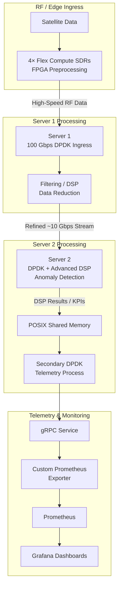

---

# Data Journey: Satellite to Dashboard

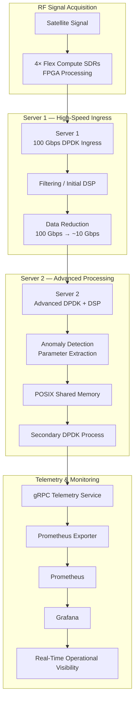

---

# Key Engineering Functions

## gRPC Telemetry Service

The **gRPC service layer** exposes processed telemetry and DSP information to
remote consumers.

Instead of allowing monitoring systems to directly access the DPDK processes,
the gRPC layer provides a clean service boundary.

The service can expose operations such as:

```protobuf
service DataService {
    rpc StreamAnomalies(SubscriptionRequest)
        returns (stream AnomalyResponse);

    rpc GetMetrics(Empty)
        returns (MetricsResponse);
}
```

This provides two complementary access patterns:

- **Streaming** for continuously changing anomaly information
- **On-demand queries** for current system and processing metrics

---

## gRPC Telemetry Flow

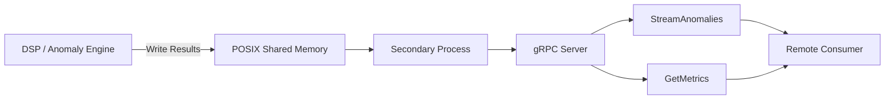

The API layer isolates external applications from internal shared-memory and
DPDK implementation details.

---

# Custom Prometheus Exporter

A custom **Prometheus exporter** bridges high-performance system telemetry into
the monitoring stack.

The exporter collects metrics from two important sources:

1. **Application / DSP telemetry through gRPC**
2. **Low-level DPDK runtime statistics through the DPDK telemetry interface**

This creates a unified observability layer that can combine signal-processing
information with system-level network statistics.

---

## Exporter Architecture

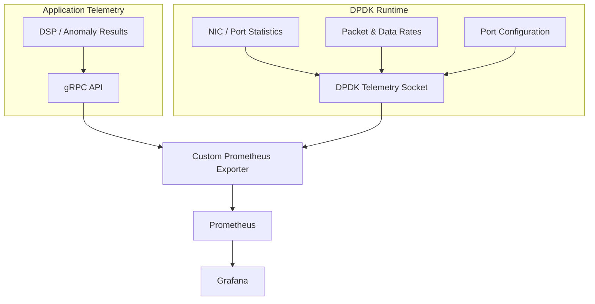

---

# DPDK Telemetry Integration

DPDK provides a runtime telemetry interface that can be inspected independently
from the main application.

The monitoring workflow uses this telemetry interface to retrieve useful
runtime information such as:

- NIC statistics
- Packet rates
- Primary-process data rate
- Port information
- Port configuration
- Runtime DPDK statistics

This allows network-level performance information to be monitored alongside
DSP and anomaly metrics.

---

## Dual Telemetry Sources

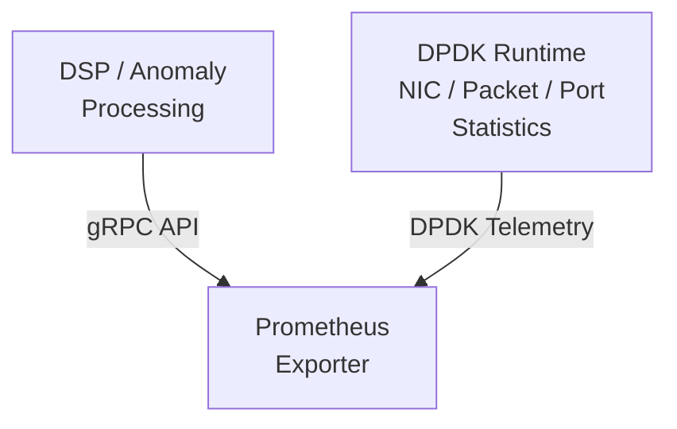

This gives operators visibility into both:

**What the signal-processing pipeline is detecting**

and

**How the underlying packet-processing infrastructure is behaving.**

---

# Prometheus Metrics Pipeline

The custom exporter periodically obtains the latest telemetry and makes it
available to the Prometheus monitoring layer.

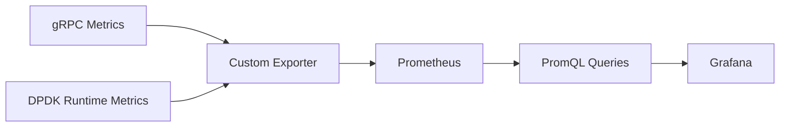

Prometheus provides the time-series layer required to analyze how system
behavior changes over time.

---

# Metrics Categories

The observability stack combines metrics from different parts of the system.

| Category | Example Information |
|---|---|
| Network | NIC statistics |
| Traffic | Packet rates |
| DPDK | Primary-process data rate |
| Ports | Port configuration and runtime state |
| DSP | Signal-processing parameters |
| Frequency Analysis | SFO / CFO and related measurements |
| Signal Quality | Peak levels and signal characteristics |
| Interference | Detected interferers and anomaly state |
| Frames | Good / bad processing statistics |
| Anomaly Detection | Detected signal abnormalities |
| Performance | Throughput and processing behavior |
| System Health | Overall pipeline operating state |

---

# Grafana Visualization

Grafana acts as the final operator-facing layer of the telemetry architecture.

Prometheus is configured as the data source, allowing dashboards to visualize
live and historical behavior.

Typical dashboard views can include:

- Network throughput
- Packet-rate trends
- DPDK runtime statistics
- DSP parameters
- Anomaly detection status
- Signal characteristics
- Interference trends
- Frame statistics
- Processing latency
- General system health

---

## Visualization Pipeline

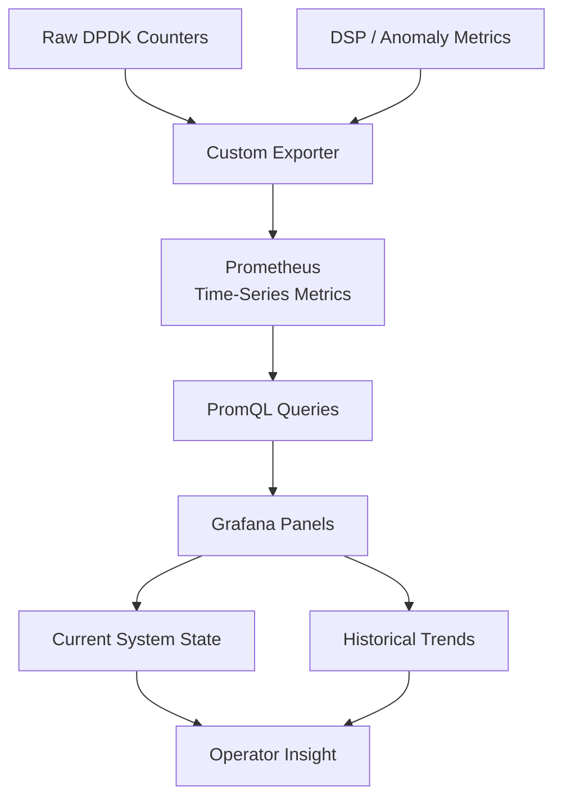

---

# Grafana Dashboard Architecture

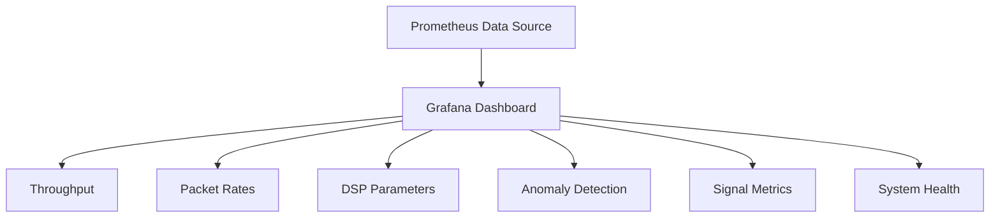

The dashboard turns low-level numerical telemetry into immediate operational
visibility.

---

# Real-Time Anomaly Monitoring

Anomaly detection is performed in the Server 2 DSP processing stage.

The observability pipeline allows these results to move from the processing
engine to remote visualization.

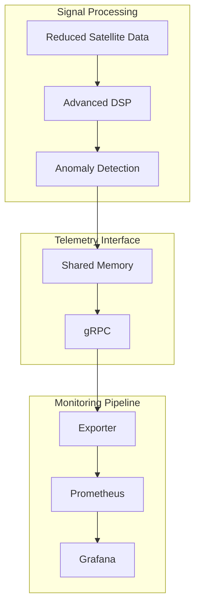

This creates a direct operational path from **signal intelligence** to
**human-readable visualization**.

---

# Performance Isolation

Monitoring a high-speed packet-processing system presents an important
engineering challenge:

> Observability must not become part of the performance bottleneck.

The design addresses this by separating monitoring from the primary data path.

| Component | Role |
|---|---|
| Primary DPDK | Performance-critical packet processing |
| Shared Memory | Efficient telemetry handoff |
| Secondary Process | Extracts telemetry independently |
| gRPC Service | Provides controlled remote access |
| Exporter | Converts data into monitoring metrics |
| Prometheus | Handles time-series monitoring workload |
| Grafana | Performs visualization independently of packet processing |

The primary data-processing workload therefore does not need to directly serve
dashboard or monitoring requests.

---

# Background Telemetry Services

The telemetry infrastructure is designed to run alongside the main processing
pipeline.

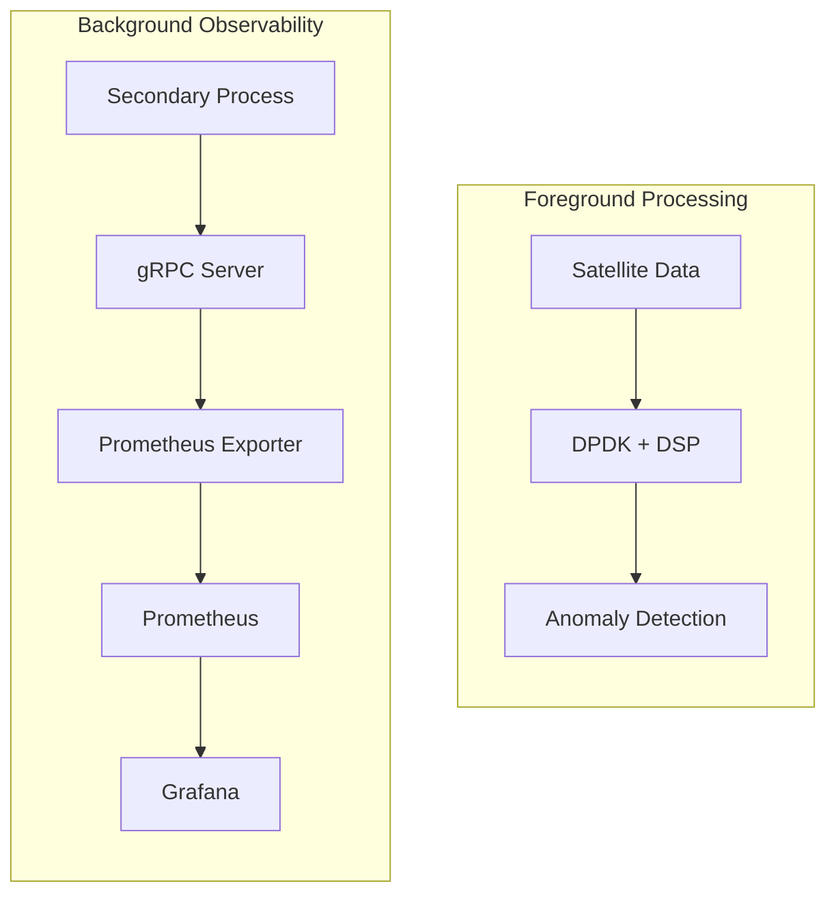

This clean separation makes the architecture easier to operate and debug.

---

# Monitoring Workflow

The complete monitoring workflow is:

### Step 1 — Acquire Satellite Data

Flex Compute SDR units acquire or replay high-speed satellite data.

### Step 2 — Receive Data on Server 1

DPDK receives the aggregated high-rate traffic and performs initial processing.

### Step 3 — Reduce the Data

Server 1 filters and reduces the data before forwarding the refined stream to
Server 2.

### Step 4 — Perform Advanced DSP

Server 2 performs deeper DSP analysis, parameter extraction, and anomaly
detection.

### Step 5 — Publish Telemetry

Processed results are transferred through shared memory to the secondary
telemetry process.

### Step 6 — Expose gRPC APIs

The telemetry service makes current DSP and anomaly information available
through gRPC.

### Step 7 — Collect Prometheus Metrics

The custom exporter obtains application metrics and low-level DPDK telemetry.

### Step 8 — Store and Query Metrics

Prometheus maintains the time-series monitoring data.

### Step 9 — Visualize in Grafana

Grafana presents live dashboards and operational trends.

---

# Operational Verification

Each part of the monitoring chain can be tested independently.

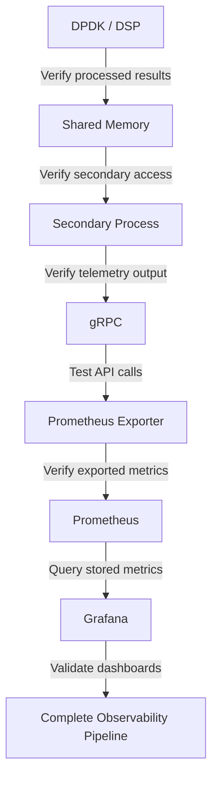

This staged architecture makes troubleshooting significantly easier because
problems can be isolated to a specific layer.

---

# High-Level Production Architecture

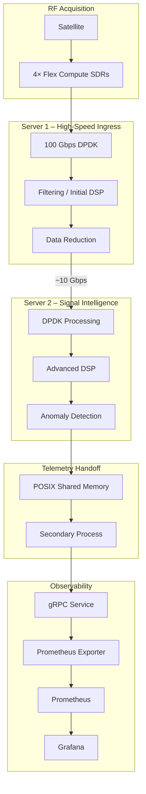

---

# Engineering Result

The completed telemetry architecture creates a dedicated **observability plane**
around the high-performance satellite processing pipeline.

It provides:

- Real-time visibility into DPDK processing
- Remote gRPC telemetry access
- DSP and anomaly information
- Low-level DPDK runtime metrics
- Custom Prometheus metric collection
- Time-series monitoring
- Interactive Grafana dashboards
- Live performance analysis
- Historical trend visualization
- Network and signal-processing insight
- Separation between monitoring and critical packet processing
- Layer-by-layer diagnostics

The result is a monitoring architecture in which the high-speed processing
pipeline remains focused on data acquisition and DSP while telemetry is
independently collected, transformed, stored, and visualized.

---

# Final Observability Pipeline

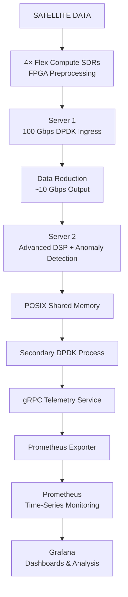

---

## From High-Speed Packets to Operational Insight

**100 Gbps DPDK processing → DSP intelligence → telemetry extraction → gRPC APIs → Prometheus metrics → Grafana visualization**

The observability layer transforms a complex high-performance signal-processing
system into an architecture that can be monitored, analyzed, and debugged in
real time.