<div style="margin: 15px 0 25px 0;">
  <a href="https://ronok-6-g-research-portfolio.vercel.app/docs/Secondary-gRPC/introduction" target="_blank" rel="noopener noreferrer" class="btn btn--primary" style="padding: 10px 18px; text-decoration: none; border-radius: 6px;">
    <i class="fas fa-external-link-alt"></i> View Detailed DPDK Core & Seqlock Docs
  </a>
</div>


# Part 3: High-Speed DPDK Telemetry Data Plane

## Overview

The **DPDK Telemetry Data Plane** provides real-time visibility into a
high-performance packet-processing system without placing the monitoring workload
directly on the critical packet-processing path.

The architecture separates responsibilities between two processes:

- The **Primary DPDK Process** performs the performance-critical packet workload
  and continuously publishes telemetry information.
- The **Secondary DPDK Process** reads telemetry independently and exposes it to
  external monitoring services.

Telemetry is transferred through **POSIX shared memory**, protected using
**sequence locks (seqlocks)** to provide consistent snapshots without forcing
the primary process to wait for telemetry readers.

The resulting data is exposed locally through a lightweight
**UNIX domain socket** and then converted into structured **gRPC / Protobuf**
messages for remote monitoring, streaming, and control applications.

This creates a clean separation between the **fast packet-processing path**
and the **monitoring/control plane**.

---

## Architecture at a Glance

| Layer | Technology | Responsibility |
|---|---|---|
| Fast Path | Primary DPDK Process | High-performance packet processing and telemetry generation |
| IPC | POSIX Shared Memory | Transfers telemetry between processes |
| Synchronization | Sequence Lock | Protects readers from inconsistent snapshots |
| Telemetry Process | Secondary DPDK Process | Reads and formats telemetry without packet processing |
| Local IPC | UNIX Domain Socket | Low-overhead local telemetry transport |
| Remote API | gRPC / Protobuf | Remote polling and streaming |
| Consumers | gRPC Clients / Monitoring Systems | Visualization, diagnostics, automation and analysis |

---

# Key Engineering Functions

## Primary DPDK Process

The **Primary DPDK Process** owns the performance-critical packet-processing
workload.

Its main responsibilities include:

- Processing the high-speed networking workload
- Maintaining operational KPIs and statistics
- Updating telemetry counters and control parameters
- Publishing telemetry into a dedicated shared-memory region
- Remaining isolated from remote monitoring activity

Instead of allowing monitoring applications to directly access the packet
processing logic, the primary process writes the information required for
telemetry into shared memory.

<div style="
  display:flex;
  flex-direction:column;
  align-items:center;
  gap:8px;
  margin:22px 0 26px;
  font-size:0.92em;
">

  <div style="
    width:min(100%, 520px);
    text-align:center;
    padding:14px 18px;
    border:1px solid rgba(128,128,128,0.30);
    border-radius:8px;
    background:rgba(128,128,128,0.06);
    color:inherit;
  ">
    <div style="font-weight:600;">High-Speed Packet Processing</div>
    <div style="font-size:0.82em; opacity:0.70; margin-top:3px;">
      Real-Time Data Plane Workload
    </div>
  </div>

  <div style="font-size:1.15em; opacity:0.65;">
    <i class="fas fa-arrow-down"></i>
  </div>

  <div style="
    width:min(100%, 520px);
    text-align:center;
    padding:14px 18px;
    border:1px solid rgba(128,128,128,0.30);
    border-radius:8px;
    background:rgba(128,128,128,0.06);
    color:inherit;
  ">
    <div style="font-weight:600;">Primary DPDK Process</div>
    <div style="font-size:0.82em; opacity:0.70; margin-top:3px;">
      Processes Packets and Updates KPIs
    </div>
  </div>

  <div style="font-size:1.15em; opacity:0.65;">
    <i class="fas fa-arrow-down"></i>
  </div>

  <div style="
    width:min(100%, 520px);
    text-align:center;
    padding:14px 18px;
    border:1px solid rgba(128,128,128,0.30);
    border-radius:8px;
    background:rgba(128,128,128,0.06);
    color:inherit;
  ">
    <div style="font-weight:600;">Shared Telemetry Region</div>
    <div style="font-size:0.82em; opacity:0.70; margin-top:3px;">
      Exposes Runtime Performance Metrics
    </div>
  </div>

</div>

This keeps monitoring activity separated from the critical processing path.

---

## Secondary DPDK Telemetry Process

A lightweight **Secondary DPDK Process** runs alongside the primary process.

Unlike the primary application, the secondary process does **not perform packet
processing**.

Its role is focused entirely on telemetry.

The secondary process:

- Waits for the primary telemetry memory region to become available
- Attaches to the telemetry region
- Reads telemetry snapshots
- Validates snapshots using sequence numbers
- Prints periodic telemetry information
- Responds to local telemetry requests
- Provides data to the gRPC layer

This separation prevents remote telemetry consumers from interacting directly
with the primary packet-processing process.

---

## POSIX Shared Memory

Telemetry exchange between the primary and secondary processes is implemented
using standard **POSIX shared memory**.

The main APIs are:

```c
shm_open()
mmap()
```

The telemetry memory region is exposed as:

```text
/dpdk_kpi_shm
```

### Why POSIX Shared Memory?

- Direct memory access between local processes
- Minimal communication overhead
- No network transport required
- Fine-grained memory permissions
- Read-only access for the telemetry reader
- Simple and portable Linux/POSIX implementation

The basic architecture is:

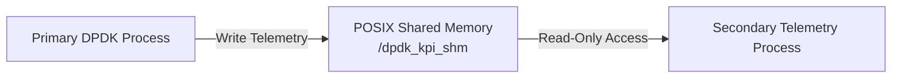

---

# Sequence Lock Synchronization

Shared memory creates a synchronization challenge.

The primary process may update telemetry at the same time that the secondary
process is reading it.

Without protection, the secondary could receive a partially updated or
**torn snapshot**.

The system solves this using a lightweight **sequence lock**.

---

## Seqlock Read Logic

The reader first checks the sequence number.

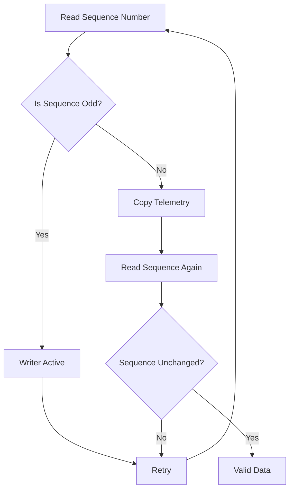

A successful telemetry read requires:

```text
seq_before == seq_after
```

and the final sequence value must be even.

---

## Seqlock Flow

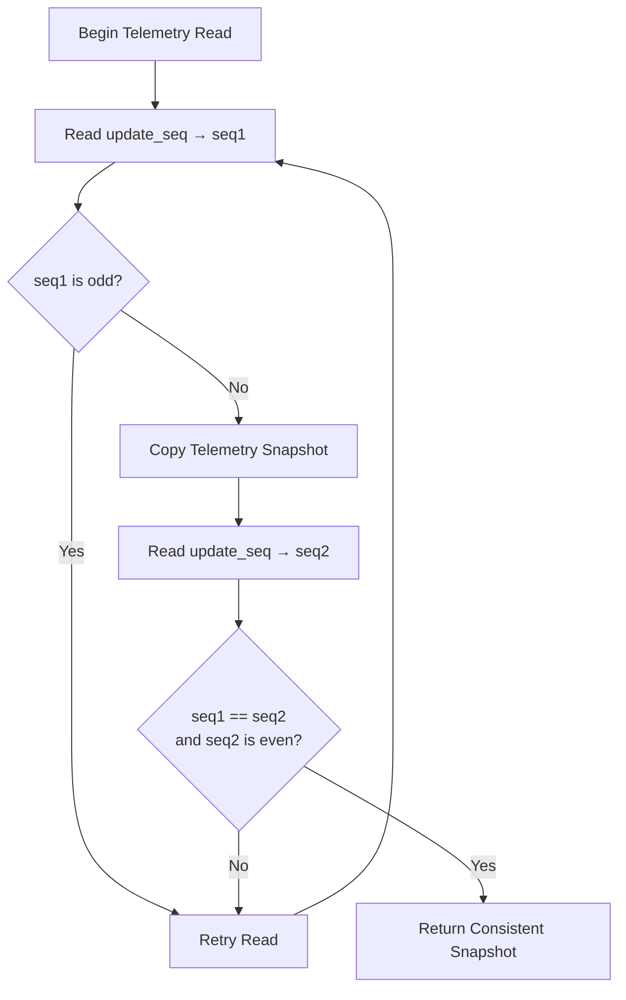

This allows the monitoring process to obtain consistent telemetry while keeping
the synchronization mechanism lightweight.

---

# UNIX Domain Socket Interface

After obtaining a consistent telemetry snapshot, the secondary process exposes
the data through a **UNIX domain socket**.

The socket endpoint is:

```text
/tmp/dpdk_kpi.sock
```

Configuration:

| Parameter | Value |
|---|---|
| Socket Type | `AF_UNIX` |
| Transport | `SOCK_STREAM` |
| Socket Path | `/tmp/dpdk_kpi.sock` |
| Primary Command | `poll_telemetry` |
| Communication | Local request/response |

UNIX sockets are used because communication occurs between services running
on the same host.

This avoids unnecessary TCP/IP networking overhead for the local telemetry
bridge.

---

## Local Telemetry Request

The gRPC service requests the latest snapshot using:

```text
poll_telemetry
```

The local flow is:

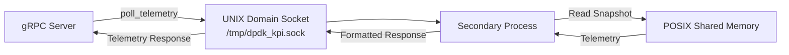

---

# gRPC Remote Telemetry Layer

The gRPC server converts the local telemetry response into structured
**Protobuf messages**.

This allows telemetry to be consumed by remote applications without exposing
the shared-memory or UNIX-socket implementation.

Two primary access patterns are supported.

### PollTelemetry

Returns the current telemetry snapshot on demand.

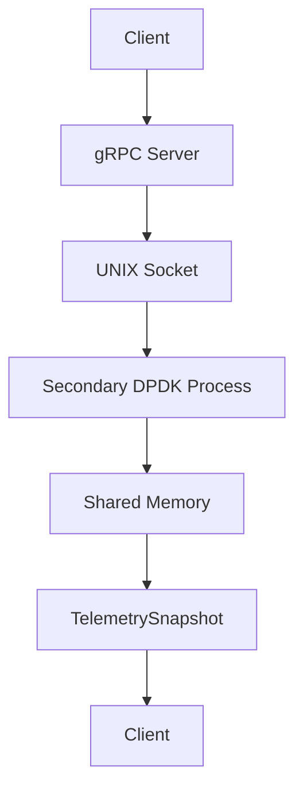

### StreamTelemetry

Provides continuously updated telemetry to a connected client.

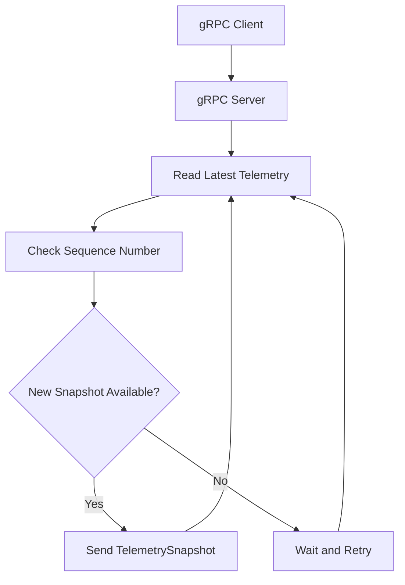

---

# Complete Control & Data Flow

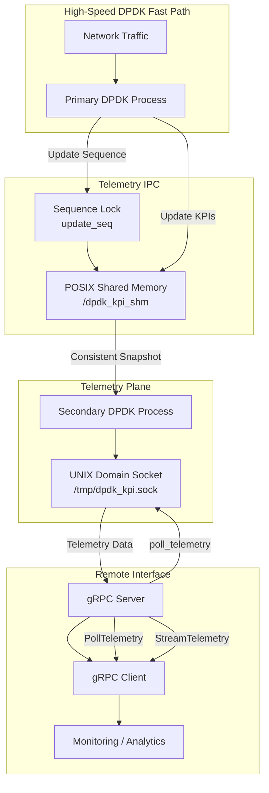

---

# End-to-End Telemetry Path

The complete telemetry pipeline can be summarized as:

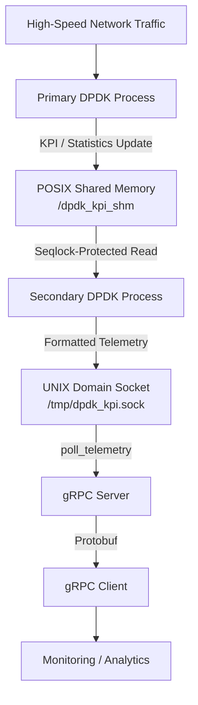

---

# Telemetry Data

The telemetry snapshot can contain multiple RF and signal-processing metrics.

| Telemetry Field | Purpose |
|---|---|
| Peak Maximum | Maximum detected signal magnitude |
| Peak Minimum | Minimum detected magnitude |
| SFO | Sampling Frequency Offset |
| CFO | Carrier Frequency Offset |
| Timestamp | Measurement time |
| Sequence | Change / update tracking |
| Interference Active | Indicates active interference detection |
| Number of Interferers | Detected interference sources |
| Interferer Peaks | Magnitudes of detected interferers |
| Primary SNR | Signal-to-noise measurement |
| Interference Cycle Count | Detection cycle tracking |
| Total Peaks | Number of detected peaks |
| Good Frames | Successfully processed frames |
| Bad Frames | Failed or invalid frames |

The socket representation uses a lightweight key-value format such as:

```text
telemetry
peak_max=-12.45
peak_min=-45.30
sfo=0.123456
cfo=-245.67
seq=123
good_frames=98
bad_frames=2
```

The gRPC layer parses these fields and creates a structured:

```text
TelemetrySnapshot
```

Protobuf message.

---

# Performance Isolation

One of the most important design goals is preventing telemetry collection from
interfering with the primary packet-processing workload.

The architecture achieves this through:

| Technique | Benefit |
|---|---|
| Dedicated Secondary Process | Separates telemetry from packet processing |
| Read-Only Shared Memory | Prevents telemetry consumers from corrupting primary data |
| Sequence Locks | Provides consistent snapshots without conventional reader locking |
| POSIX Memory Mapping | Enables efficient local IPC |
| UNIX Domain Socket | Low-overhead local service communication |
| gRPC Boundary | Keeps remote applications away from the DPDK process |
| Sequence Tracking | Prevents unnecessary duplicate telemetry delivery |

---

# Error Handling & Reliability

The telemetry system includes several mechanisms to improve operational
reliability.

### Shared Memory

- Secondary waits until the primary creates the shared-memory region
- Retry logic handles startup-order differences
- Read-only mappings reduce accidental modifications

### Sequence Lock

- Detects concurrent writes
- Retries inconsistent reads
- Prevents torn telemetry snapshots

### UNIX Socket

- Removes stale socket files during startup
- Uses local filesystem-based socket addressing
- Supports non-blocking event handling
- Handles telemetry requests independently from packet processing

### gRPC Layer

- Socket timeout prevents indefinite blocking
- Invalid responses are handled safely
- Communication exceptions are logged
- Empty snapshots can be returned when telemetry is unavailable
- Sequence checking prevents duplicate streamed samples

---

# Remote Monitoring Architecture

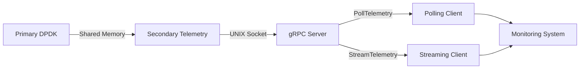

This enables external monitoring applications to consume DPDK performance
information without direct access to the primary process.

---

# Process Deployment

The system consists of four logical runtime components.

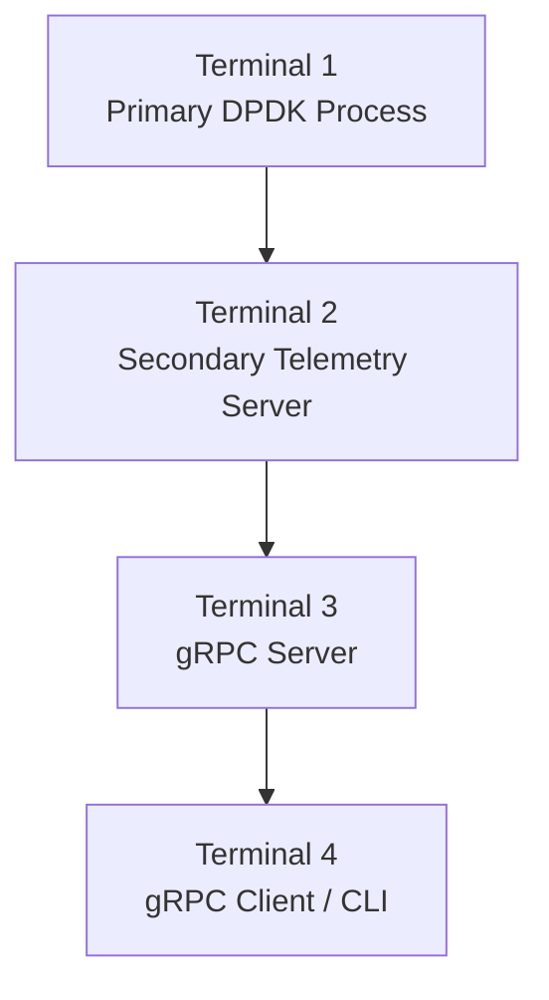

Typical startup order:

```bash
# Primary DPDK process
sudo build/primary -l 0-11 --socket-mem 1024,0

# Secondary telemetry process
sudo build/secondary_server --proc-type=secondary -l 0-11

# gRPC server
python run_server.py

# gRPC client
python run_client.py --cli
```

---

# Engineering Result

The completed architecture creates a **non-intrusive telemetry path** around
the high-performance DPDK packet-processing system.

It provides:

- High-performance primary DPDK processing
- Independent secondary telemetry extraction
- POSIX shared-memory IPC
- Seqlock-protected consistent snapshots
- Read-only telemetry access
- Low-overhead UNIX socket communication
- Remote gRPC polling
- Real-time gRPC streaming
- Structured Protobuf telemetry
- Error and timeout handling
- Sequence-based change detection
- Integration with external monitoring systems

The result is a modular architecture in which the **critical DPDK processing
path remains isolated**, while operational metrics remain accessible to remote
monitoring and control applications.

---

## Final Architecture Summary

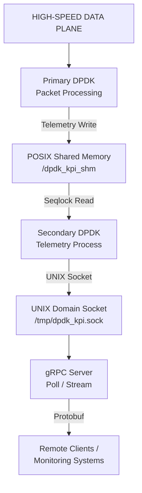