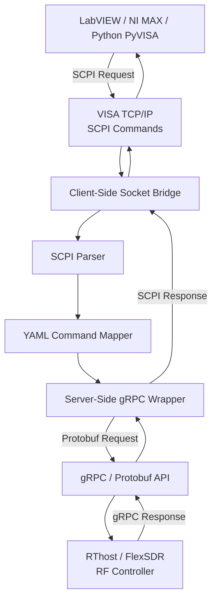
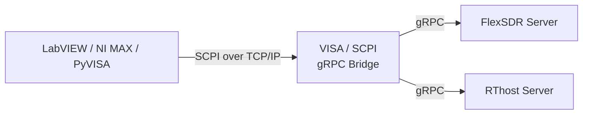
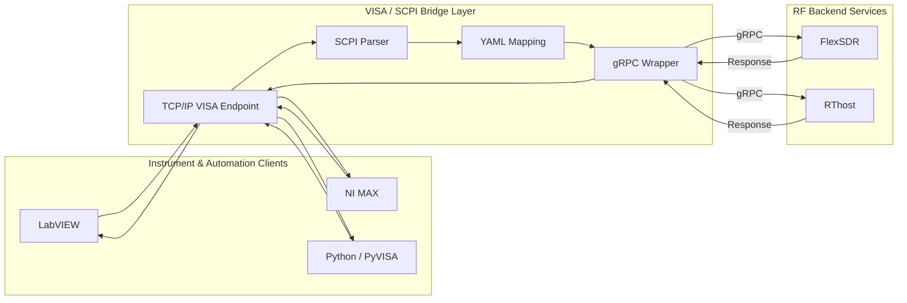

<div style="margin: 15px 0 25px 0;">
  <a href="https://ronok-6-g-research-portfolio.vercel.app/docs/LabVIEW-gRPC-VISA/introduction"
     target="_blank"
     rel="noopener noreferrer"
     class="btn btn--primary"
     style="padding: 10px 18px; text-decoration: none; border-radius: 6px;">
    <i class="fas fa-external-link-alt"></i>
    View Detailed Control & SCPI Docs
  </a>
</div>

# Part 2: Instrumentation & Control Plane

## Overview

The **Instrumentation & Control Plane** provides a compatibility layer between traditional **VISA/SCPI-based test and measurement tools** and modern **gRPC-based RF control services**.

The system allows **LabVIEW**, **NI MAX**, and **Python/PyVISA** clients to communicate with remote RF services through a familiar TCP/IP VISA interface.

SCPI commands received from the client are:

1. Received over **VISA TCP/IP**
2. Parsed by the bridge
3. Matched against configurable **YAML command mappings**
4. Converted into **gRPC / Protobuf requests**
5. Forwarded to the selected RF backend
6. Converted back into SCPI-formatted responses
7. Returned to the original client

This architecture keeps the RF backend independent from legacy instrument protocols while preserving compatibility with existing laboratory and automation workflows.

---

## Architecture at a Glance

| Layer | Technology | Responsibility |
|---|---|---|
| Client | LabVIEW / NI MAX / PyVISA | Instrument control and automation |
| Transport | VISA TCP/IP / Raw Socket | SCPI command transport |
| Client Bridge | Socket Proxy | Provides VISA-compatible TCP endpoint |
| Translation | SCPI Parser + YAML Mapper | Maps SCPI commands to backend operations |
| Server Bridge | gRPC Wrapper | Converts SCPI operations into gRPC requests |
| Backend | RThost / FlexSDR | RF control and device services |
| Diagnostics | Logging / RTT / Heartbeat | Communication monitoring and troubleshooting |

---

## Key Engineering Functions

### VISA/SCPI-to-gRPC Translation

The bridge converts traditional instrument-style **SCPI commands** into **Protobuf-based gRPC requests** and converts backend responses into VISA/SCPI-compatible replies.

This allows existing measurement tools to interact with modern distributed RF services without exposing gRPC implementation details to the client.

---

### LabVIEW & NI MAX Integration

A standard **TCP/IP VISA endpoint** allows LabVIEW VIs and NI MAX to communicate with the RF backend using familiar SCPI workflows.

Existing instrument-control applications can therefore continue using standard VISA communication patterns while the backend operates through gRPC.

---

### Python / PyVISA Automation

Python applications can connect to the same bridge through **PyVISA**.

The same SCPI commands available to LabVIEW can be used for:

- Automated test scripts
- RF configuration
- Device queries
- Data logging
- Research automation
- Integration testing

---

### YAML-Based Command Mapping

SCPI commands are mapped to corresponding gRPC methods through configurable **YAML definitions**.

This separates the external instrument command interface from the backend API.

```text
SCPI Command
     |
     v
YAML Mapping
     |
     v
gRPC Method
     |
     v
RF Backend
```

This approach makes the bridge easier to extend because command mappings can be modified without tightly coupling client applications to backend implementation details.

---

### Dual-Bridge Architecture

The system separates communication into two logical bridge layers:

**Client-Side Bridge**

- Accepts VISA TCP/IP connections
- Receives raw SCPI commands
- Provides a stable socket endpoint
- Returns formatted SCPI responses

**Server-Side Bridge**

- Performs SCPI-to-gRPC translation
- Maps commands through YAML configuration
- Creates Protobuf requests
- Communicates with the backend gRPC service
- Converts gRPC responses back to SCPI

This separation keeps the main RF controller focused on its native API responsibilities.

---

## Control & Data Flow



### Simplified Request Path

```text
LabVIEW / NI MAX / PyVISA
            |
            v
       VISA TCP/IP
            |
            v
   Client Socket Bridge
            |
            v
       SCPI Parser
            |
            v
      YAML Mapping
            |
            v
    gRPC Wrapper Bridge
            |
            v
     gRPC / Protobuf
            |
            v
   RThost / FlexSDR
       RF Controller
```

### Response Path

```text
RThost / FlexSDR
       RF Controller
            |
            v
      gRPC Response
            |
            v
    gRPC Wrapper Bridge
            |
            v
   SCPI-Formatted Response
            |
            v
   Client Socket Bridge
            |
            v
       VISA TCP/IP
            |
            v
LabVIEW / NI MAX / PyVISA
```

---

## Multi-Server Backend Support

The control bridge can communicate with different backend services depending on the selected configuration.



Backend addresses and ports can be configured independently, allowing the same bridge architecture to support multiple RF services.

---

## Round-Trip Performance Monitoring

The bridge records timing information for command transactions.

A typical transaction follows:

```text
Command Received
      |
      v
SCPI Processing
      |
      v
gRPC Request
      |
      v
Backend Processing
      |
      v
gRPC Response
      |
      v
SCPI Response
      |
      v
Round-Trip Time Logged
```

The logging system can record:

- Command receive time
- Backend response time
- End-to-end Round Trip Time (RTT)
- Connection events
- Communication errors
- Invalid SCPI commands

This provides useful diagnostics when evaluating communication performance between the client and remote RF services.

---

## Reliable TCP/IP Communication

The communication layer includes several reliability mechanisms.

| Mechanism | Purpose |
|---|---|
| TCP Keepalive | Detect inactive or disconnected connections |
| Heartbeat Monitoring | Track client/server availability |
| Configurable Timeout | Prevent indefinitely blocked transactions |
| Termination Character Handling | Ensure correct SCPI message framing |
| Connection Logging | Track session activity |
| Error Propagation | Return backend failures to the client |
| VISA Configuration Validation | Keep LabVIEW settings consistent with NI MAX |

These mechanisms improve stability when the bridge is used in laboratory and automated test environments.

---

## Bidirectional RF Control

The architecture was validated for both **read** and **write** operations.

### Query Path

```text
LabVIEW
   |
   |  SCPI Query
   v
Bridge
   |
   |  gRPC Request
   v
RF Controller
   |
   |  Current Device Value
   v
Bridge
   |
   |  SCPI Response
   v
LabVIEW
```

### Configuration Path

```text
LabVIEW
   |
   |  SCPI Configuration Command
   v
Bridge
   |
   |  gRPC Set Request
   v
RF Controller
   |
   |  Device Parameter Updated
   v
Success Response
```

Validation demonstrated operations including:

- Reading RF frequency values
- Updating RF parameters
- Querying device state
- Returning successful write confirmations
- Reporting invalid SCPI commands
- Verifying values through LabVIEW and NI MAX

---

## Cross-Platform Bridge Software

Standalone **PyQt-based bridge applications** provide a graphical interface for running and monitoring the bridge on:

- Windows 10/11
- Ubuntu / Debian-based Linux systems

The interface provides:

- One-click bridge start/stop
- Configurable VISA TCP/IP port
- Backend server selection
- Connection-status monitoring
- LabVIEW / PyVISA client status
- Real-time activity logging
- Debugging information
- RThost and FlexSDR backend support

---

## Reliability & Diagnostics

Development and validation addressed several practical integration challenges associated with VISA and TCP/IP communication.

These included:

- VISA resource configuration
- Raw TCP/IP socket configuration
- Termination-character handling
- Command timeout configuration
- Firewall and network connectivity
- Client/server connection monitoring
- Backend communication errors
- Invalid command handling
- Consistent configuration between NI MAX and LabVIEW

The bridge therefore provides not only protocol translation but also a structured diagnostics layer for troubleshooting distributed RF control workflows.

---

## Final Architecture



---

## Result

The resulting architecture provides a reusable **instrumentation compatibility layer** between legacy VISA/SCPI-based engineering tools and modern gRPC-based RF services.

It enables:

- Standard LabVIEW and NI MAX workflows
- Python/PyVISA automation
- Flexible YAML-driven command translation
- Multiple RF backend services
- Bidirectional RF configuration and queries
- Round-trip performance monitoring
- Robust TCP/IP communication
- Cross-platform bridge deployment

The result is a modular control architecture that preserves familiar **VISA/SCPI instrument interfaces** while enabling access to modern **distributed gRPC RF services**.