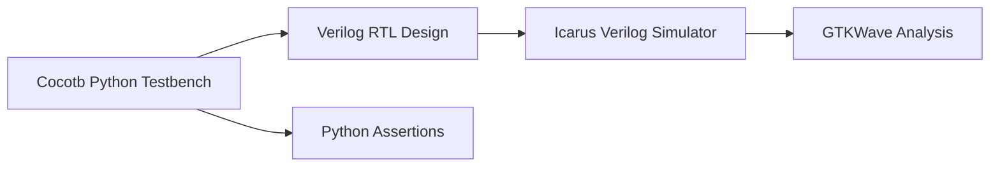
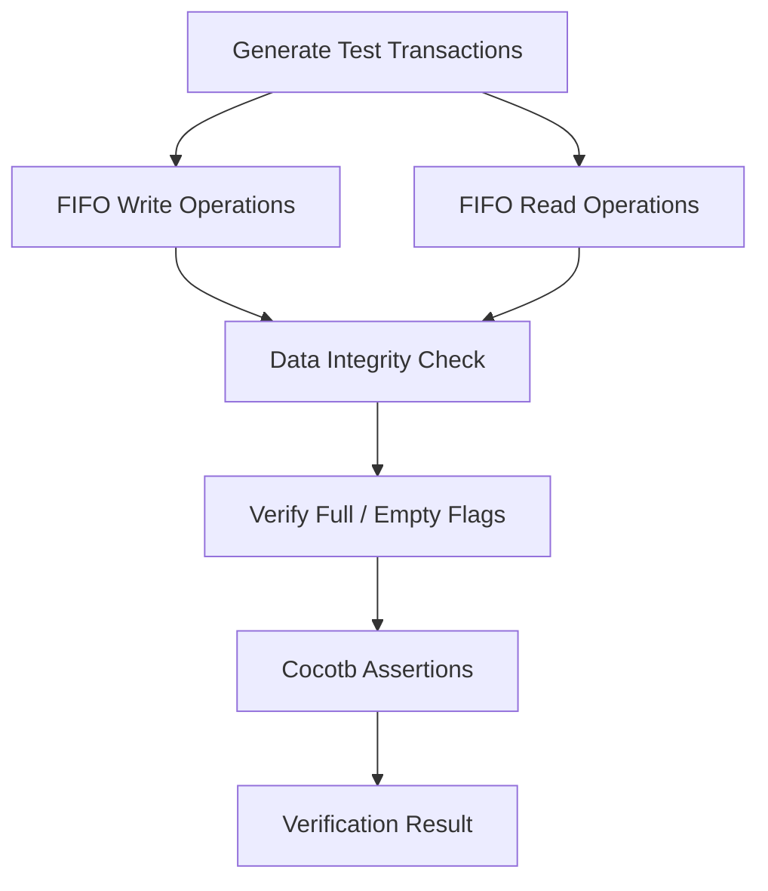
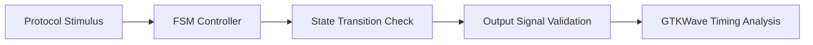

# Configurable Synchronous FIFO & Protocol FSM Controllers

## Overview

This project focuses on the **RTL design and verification of reusable digital hardware components** using Verilog.

The objective was to develop robust, configurable hardware building blocks with emphasis on:

- Parameterized RTL architecture
- Reliable control logic implementation
- Edge-accurate sequential behavior
- Hardware verification through automated simulation

The project includes a **configurable synchronous FIFO buffer** and **serial protocol finite state machine (FSM) controllers**, both verified using a Python-based Cocotb co-simulation environment.

---

# System Architecture Overview

```text
                 Digital Hardware Building Blocks

                         +----------------+
                         |                |
                         |   Testbench    |
                         |  (Cocotb)      |
                         |                |
                         +-------+--------+
                                 |
                                 |
              +------------------+------------------+
              |                                     |
              v                                     v

     +-------------------+              +-------------------+
     |                   |              |                   |
     | Synchronous FIFO  |              | Protocol FSM      |
     | Controller        |              | Controller        |
     |                   |              |                   |
     +-------------------+              +-------------------+

              |                                     |
              v                                     v

     Data Buffering Logic              Serial Control Logic

```

---

# Key Modules Designed

## 1. Configurable Synchronous FIFO

A parameterized synchronous FIFO buffer was designed to provide reliable temporary data storage between digital processing blocks.

### Features

- Configurable data width
- Configurable FIFO depth
- Independent read and write pointers
- Full and empty detection logic
- Almost-full and almost-empty status indicators
- Circular pointer rollover handling

### Functional Behavior

The FIFO supports simultaneous read and write operations while maintaining correct data ordering.

```text
             Write Interface

                  |
                  v

        +-------------------+
        |                   |
        |  Synchronous FIFO |
        |                   |
        +-------------------+

                  |
                  v

             Read Interface
```

### Verification Coverage

The FIFO was verified using Cocotb-based simulation with automated assertions covering:

- Concurrent read/write transactions
- Pointer increment behavior
- Pointer rollover conditions
- Full condition handling
- Empty condition handling
- Overflow prevention
- Underflow prevention

---

# 2. Serial Protocol FSM Controllers

Finite State Machine controllers were designed for serial protocol control applications.

The design implements both:

- **Moore FSM architecture**
- **Mealy FSM architecture**

with registered outputs to ensure stable and glitch-free control signals.

---

## FSM Design Flow

```text
          Input Signals

                |
                v

      +----------------+
      |                |
      | State Register |
      |                |
      +----------------+

                |
                v

      +----------------+
      | Next-State     |
      | Logic          |
      +----------------+

                |
                v

      +----------------+
      | Output Logic   |
      +----------------+

                |
                v

        Control Signals

```

---

## FSM Design Features

- Deterministic state transitions
- Registered output generation
- Clock-edge synchronized operation
- Glitch-free control signaling
- Protocol timing validation

The controllers were simulated to validate:

- State transition accuracy
- Clock-edge behavior
- Reset operation
- Output timing correctness

---

# Verification Environment

The verification framework combines RTL simulation with Python-based automated testing.

## Verification Architecture



---

# Verification Methodology

## Cocotb Co-Simulation

Cocotb was used as the primary verification framework to create automated hardware tests.

Verification features include:

- Python-driven stimulus generation
- Automated functional checks
- Transaction-based testing
- Assertion-based validation
- Simulation result analysis

---

## Simulation Tools

| Tool | Purpose |
|---|---|
| Verilog | RTL hardware description |
| Cocotb | Python-based verification framework |
| Python | Test automation and assertions |
| Icarus Verilog | RTL simulation engine |
| GTKWave | Waveform inspection and debugging |

---

# FIFO Verification Flow



---

# FSM Verification Flow



---

# Design Highlights

## Parameterized RTL Design

The FIFO architecture was designed with configurable parameters, allowing reuse across different hardware applications.

Key configurable elements:

- Data width
- Buffer depth
- Status thresholds

---

## Robust Sequential Control

The FSM controllers use clock-synchronized state updates and registered outputs to ensure reliable operation in synchronous digital systems.

---

## Automated Hardware Verification

The Cocotb environment enables repeatable regression testing without manual waveform inspection for every simulation run.

---

# Technology Stack

| Category | Technology |
|---|---|
| RTL Design | Verilog |
| Verification | Cocotb |
| Programming | Python |
| Simulation | Icarus Verilog |
| Waveform Debugging | GTKWave |

---

# Engineering Outcome

This project demonstrates the complete workflow of developing reusable digital hardware components:

```text
RTL Architecture Design
          |
          v
Parameterized Verilog Implementation
          |
          v
Cocotb Verification Environment
          |
          v
Simulation & Waveform Analysis
          |
          v
Validated Hardware Building Blocks
```

The final design provides reusable, verified RTL modules suitable for integration into larger digital systems requiring reliable buffering, protocol control, and deterministic hardware behavior.