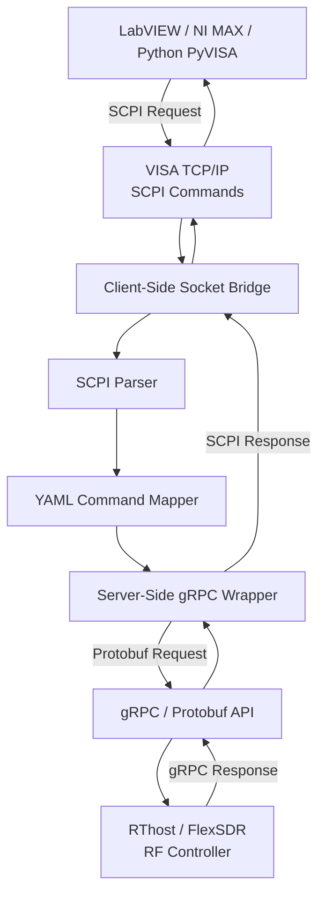
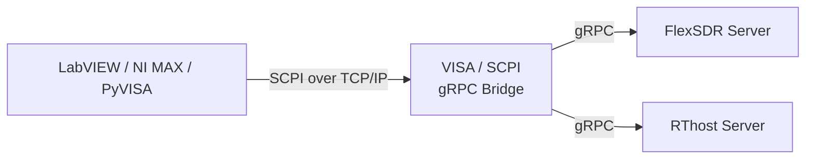
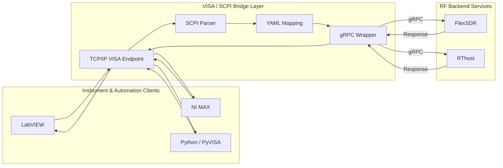

  <a href="https://ronok-6-g-research-portfolio.vercel.app/docs/LabVIEW-gRPC-VISA/introduction"
     target="_blank"
     rel="noopener noreferrer"
     class="btn btn--primary"
     style="padding: 10px 18px; text-decoration: none; border-radius: 6px;">
    <i class="fas fa-external-link-alt"></i>
    View Detailed Control & SCPI Docs
  </a>

# Part 2: Instrumentation & Control Plane

## Overview

The **Instrumentation & Control Plane** provides a compatibility layer between traditional **VISA/SCPI-based test and measurement tools** and modern **gRPC-based RF control services**.

The system allows **LabVIEW**, **NI MAX**, and **Python/PyVISA** clients to communicate with remote RF services through a familiar TCP/IP VISA interface.

SCPI commands received from the client are:

1. Received over **VISA TCP/IP**
2. Parsed by the bridge
3. Matched against configurable **YAML command mappings**
4. Converted into **gRPC / Protobuf requests**
5. Forwarded to the selected RF backend
6. Converted back into SCPI-formatted responses
7. Returned to the original client

This architecture keeps the RF backend independent from legacy instrument protocols while preserving compatibility with existing laboratory and automation workflows.

---

## Architecture at a Glance

| Layer | Technology | Responsibility |
|---|---|---|
| Client | LabVIEW / NI MAX / PyVISA | Instrument control and automation |
| Transport | VISA TCP/IP / Raw Socket | SCPI command transport |
| Client Bridge | Socket Proxy | Provides VISA-compatible TCP endpoint |
| Translation | SCPI Parser + YAML Mapper | Maps SCPI commands to backend operations |
| Server Bridge | gRPC Wrapper | Converts SCPI operations into gRPC requests |
| Backend | RThost / FlexSDR | RF control and device services |
| Diagnostics | Logging / RTT / Heartbeat | Communication monitoring and troubleshooting |

---

## Key Engineering Functions

### VISA/SCPI-to-gRPC Translation

The bridge converts traditional instrument-style **SCPI commands** into **Protobuf-based gRPC requests** and converts backend responses into VISA/SCPI-compatible replies.

This allows existing measurement tools to interact with modern distributed RF services without exposing gRPC implementation details to the client.

---

### LabVIEW & NI MAX Integration

A standard **TCP/IP VISA endpoint** allows LabVIEW VIs and NI MAX to communicate with the RF backend using familiar SCPI workflows.

Existing instrument-control applications can therefore continue using standard VISA communication patterns while the backend operates through gRPC.

---

### Python / PyVISA Automation

Python applications can connect to the same bridge through **PyVISA**.

The same SCPI commands available to LabVIEW can be used for:

- Automated test scripts
- RF configuration
- Device queries
- Data logging
- Research automation
- Integration testing

---

### YAML-Based Command Mapping

  SCPI commands are mapped to corresponding gRPC methods through configurable <strong>YAML definitions</strong>.
  This keeps the external instrument command interface separate from the backend API.

  

    
SCPI Command

    

      Instrument Interface
    

  

  

    <i class="fas fa-arrow-right"></i>
  

  

    
YAML Mapping

    

      Command Translation
    

  

  

    <i class="fas fa-arrow-right"></i>
  

  

    
gRPC Method

    

      Backend API Call
    

  

  

    <i class="fas fa-arrow-right"></i>
  

  

    
RF Backend

    

      Hardware Control
    

  

This approach makes the bridge easier to extend because command mappings can be modified without tightly coupling client applications to backend implementation details.

---

### Dual-Bridge Architecture

The system separates communication into two logical bridge layers:

**Client-Side Bridge**

- Accepts VISA TCP/IP connections
- Receives raw SCPI commands
- Provides a stable socket endpoint
- Returns formatted SCPI responses

**Server-Side Bridge**

- Performs SCPI-to-gRPC translation
- Maps commands through YAML configuration
- Creates Protobuf requests
- Communicates with the backend gRPC service
- Converts gRPC responses back to SCPI

This separation keeps the main RF controller focused on its native API responsibilities.

---

## Control & Data Flow

### Simplified Request & Response Path

  Commands travel from the instrument-control client to the RF backend, while responses return through the same layers in reverse.

  

    
LabVIEW / NI MAX / PyVISA

    

      Test &amp; Instrument Control Clients
    

  

  

    <i class="fas fa-arrow-down"></i>
    Request
    <i class="fas fa-arrow-up"></i>
    Response
  

  

    
VISA TCP/IP

    

      Network Transport Layer
    

  

  

    <i class="fas fa-arrows-alt-v"></i>
  

  

    
Client Socket Bridge

    

      TCP Connection &amp; Message Handling
    

  

  

    <i class="fas fa-arrows-alt-v"></i>
  

  

    
SCPI Parser / Formatter

    

      Command Parsing &amp; Response Formatting
    

  

  

    <i class="fas fa-arrows-alt-v"></i>
  

  

    
YAML Mapping

    

      SCPI-to-gRPC Command Mapping
    

  

  

    <i class="fas fa-arrows-alt-v"></i>
  

  

    
gRPC Wrapper Bridge

    

      API Translation Layer
    

  

  

    <i class="fas fa-arrows-alt-v"></i>
  

  

    
gRPC / Protobuf

    

      Remote Procedure Call Interface
    

  

  

    <i class="fas fa-arrows-alt-v"></i>
  

  

    
RThost / FlexSDR RF Controller

    

      RF Hardware Control Backend
    

  

---

## Multi-Server Backend Support

The control bridge can communicate with different backend services depending on the selected configuration.

Backend addresses and ports can be configured independently, allowing the same bridge architecture to support multiple RF services.

---

## Round-Trip Performance Monitoring

  The bridge records timing information for each command transaction, allowing end-to-end response latency to be measured across the complete SCPI-to-gRPC processing path.

  

    
Command Received

    

      Transaction Timer Starts
    

  

  

    <i class="fas fa-arrow-down"></i>
  

  

    
SCPI Processing

    

      Parse, Validate &amp; Map Command
    

  

  

    <i class="fas fa-arrow-down"></i>
  

  

    
gRPC Request

    

      Request Forwarded to Backend
    

  

  

    <i class="fas fa-arrow-down"></i>
  

  

    
Backend Processing

    

      RF Controller Executes Operation
    

  

  

    <i class="fas fa-arrow-down"></i>
  

  

    
gRPC Response

    

      Backend Result Returned
    

  

  

    <i class="fas fa-arrow-down"></i>
  

  

    
SCPI Response

    

      Result Converted to Instrument Format
    

  

  

    <i class="fas fa-arrow-down"></i>
  

  

    
Round-Trip Time Logged

    

      End-to-End Transaction Latency Recorded
    

  

The logging system can record:

- Command receive time
- Backend response time
- End-to-end Round Trip Time (RTT)
- Connection events
- Communication errors
- Invalid SCPI commands

This provides useful diagnostics when evaluating communication performance between the client and remote RF services.

---

## Reliable TCP/IP Communication

The communication layer includes several reliability mechanisms.

| Mechanism | Purpose |
|---|---|
| TCP Keepalive | Detect inactive or disconnected connections |
| Heartbeat Monitoring | Track client/server availability |
| Configurable Timeout | Prevent indefinitely blocked transactions |
| Termination Character Handling | Ensure correct SCPI message framing |
| Connection Logging | Track session activity |
| Error Propagation | Return backend failures to the client |
| VISA Configuration Validation | Keep LabVIEW settings consistent with NI MAX |

These mechanisms improve stability when the bridge is used in laboratory and automated test environments.

---

## Bidirectional RF Control

  The architecture supports both <strong>read</strong> and <strong>write</strong> operations, allowing external applications to query live RF parameters and update device configuration through the same SCPI-to-gRPC bridge.

### Query Path

  

    
LabVIEW

    

      Sends SCPI Query
    

  

  

    <i class="fas fa-arrow-down"></i>
  

  

    
SCPI / gRPC Bridge

    

      Translates Query to gRPC Request
    

  

  

    <i class="fas fa-arrow-down"></i>
  

  

    
RF Controller

    

      Reads Current Device Value
    

  

  

    <i class="fas fa-arrow-up"></i>
  

  

    
SCPI / gRPC Bridge

    

      Converts Device Value to SCPI Response
    

  

  

    <i class="fas fa-arrow-up"></i>
  

  

    
LabVIEW

    

      Receives Current RF Parameter
    

  

### Configuration Path

  

    
LabVIEW

    

      Sends SCPI Configuration Command
    

  

  

    <i class="fas fa-arrow-down"></i>
  

  

    
SCPI / gRPC Bridge

    

      Translates Command to gRPC Set Request
    

  

  

    <i class="fas fa-arrow-down"></i>
  

  

    
RF Controller

    

      Updates Device Parameter
    

  

  

    <i class="fas fa-arrow-down"></i>
  

  

    
Success Response

    

      Configuration Update Confirmed
    

  

Validation demonstrated operations including:

- Reading RF frequency values
- Updating RF parameters
- Querying device state
- Returning successful write confirmations
- Reporting invalid SCPI commands
- Verifying values through LabVIEW and NI MAX

---

## Cross-Platform Bridge Software

Standalone **PyQt-based bridge applications** provide a graphical interface for running and monitoring the bridge on:

- Windows 10/11
- Ubuntu / Debian-based Linux systems

The interface provides:

- One-click bridge start/stop
- Configurable VISA TCP/IP port
- Backend server selection
- Connection-status monitoring
- LabVIEW / PyVISA client status
- Real-time activity logging
- Debugging information
- RThost and FlexSDR backend support

---

## Reliability & Diagnostics

Development and validation addressed several practical integration challenges associated with VISA and TCP/IP communication.

These included:

- VISA resource configuration
- Raw TCP/IP socket configuration
- Termination-character handling
- Command timeout configuration
- Firewall and network connectivity
- Client/server connection monitoring
- Backend communication errors
- Invalid command handling
- Consistent configuration between NI MAX and LabVIEW

The bridge therefore provides not only protocol translation but also a structured diagnostics layer for troubleshooting distributed RF control workflows.

---

## Final Architecture

---

## Result

The resulting architecture provides a reusable **instrumentation compatibility layer** between legacy VISA/SCPI-based engineering tools and modern gRPC-based RF services.

It enables:

- Standard LabVIEW and NI MAX workflows
- Python/PyVISA automation
- Flexible YAML-driven command translation
- Multiple RF backend services
- Bidirectional RF configuration and queries
- Round-trip performance monitoring
- Robust TCP/IP communication
- Cross-platform bridge deployment

The result is a modular control architecture that preserves familiar **VISA/SCPI instrument interfaces** while enabling access to modern **distributed gRPC RF services**.