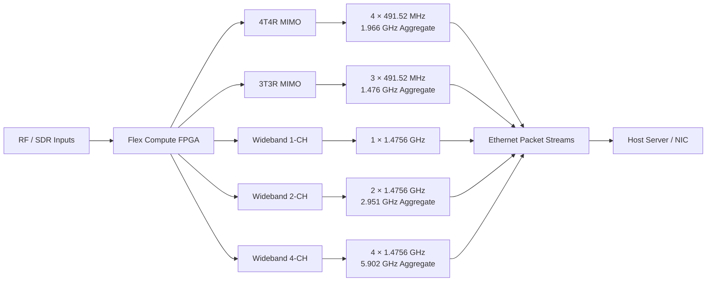
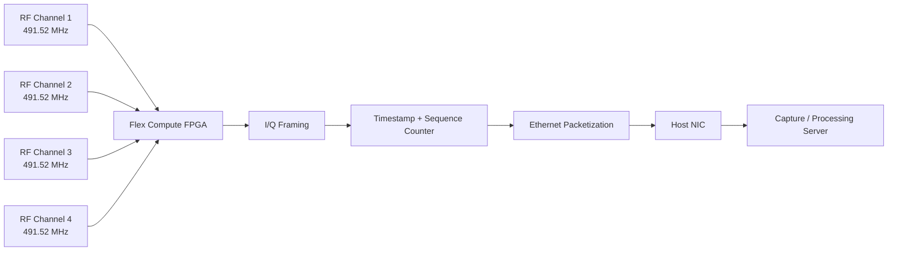
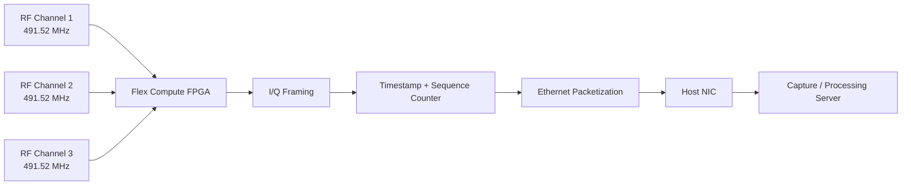
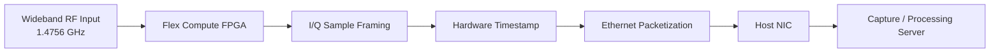
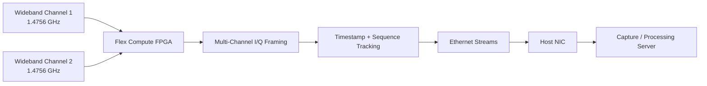
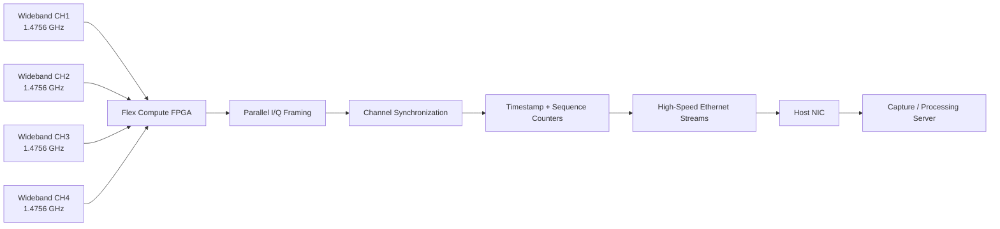

  <a href="https://your-detailed-docs-site.com/part1-fpga"
     target="_blank"
     rel="noopener noreferrer"
     class="btn btn--primary"
     style="padding:10px 18px; text-decoration:none; border-radius:6px;">
    <i class="fas fa-external-link-alt"></i> View Detailed FPGA & SDR Documentation
  </a>

## Overview

This stage of the system handles the **high-speed RF ingress path** using Satellite Flex Compute FPGA modules. The FPGA receives digitized wideband RF data, organizes raw I/Q samples into structured Ethernet packets, and streams them to host servers for further processing.

The design focuses on **high throughput, deterministic timing, channel synchronization, and reliable packet delivery** across multi-channel and wideband operating modes.

## Key Engineering Functions

### High-Speed RF Data Streaming

- Supports multi-carrier and wideband I/Q data acquisition.
- Streams data from FPGA hardware directly to server network interfaces.
- Supports data rates of up to **25 Gbps per SDR channel**.

### Hardware Timestamping & Packet Tracking

- Inserts hardware-generated timestamps into packet headers for precise time alignment.
- Uses sequence counters to track packet continuity and detect packet loss.
- Enables synchronization across multiple RF and spatial channels.

### Multi-Channel & Wideband Scaling

Supports multiple acquisition modes, including:

- **4T4R MIMO** — 4 channels × 491.52 MHz
- **3T3R MIMO** — 3 channels × 491.52 MHz
- **Wideband 1-Channel** — 1.4756 GHz
- **Wideband 2-Channel** — 2.951 GHz aggregate
- **Wideband 4-Channel** — up to **5.902 GHz aggregate**

#### Channel Scaling Overview

---

#### 4T4R MIMO Data Path

**Aggregate RF bandwidth:** approximately **1.966 GHz**

---

#### 3T3R MIMO Data Path

**Aggregate RF bandwidth:** approximately **1.476 GHz**

---

#### Wideband 1-Channel Mode

---

#### Wideband 2-Channel Mode

**Aggregate RF bandwidth:** approximately **2.951 GHz**

---

#### Wideband 4-Channel Mode

**Maximum aggregate RF bandwidth:** approximately **5.902 GHz**

---

#### End-to-End FPGA Ingress Architecture

```mermaid
flowchart LR
    RF[RF / SDR Channels]
    ADC[Digitized I/Q Samples]
    FPGA[Flex Compute FPGA]
    FRAME[Packet Framing]
    TIME[Hardware Timestamping]
    SEQ[Sequence Tracking]
    ETH[Ethernet Packetization]
    NIC[High-Speed NIC]
    HOST[Linux Capture Server]

    RF --> ADC
    ADC --> FPGA
    FPGA --> FRAME
    FRAME --> TIME
    TIME --> SEQ
    SEQ --> ETH
    ETH --> NIC
    NIC --> HOST
```

### FPGA-to-Server Data Path

The FPGA forms the first stage of the complete high-speed data pipeline:

**RF Input → FPGA Digitization → I/Q Framing → Hardware Timestamping → Ethernet Packetization → Host Server NIC**

This structure provides a scalable front-end for high-throughput RF capture and downstream software processing.